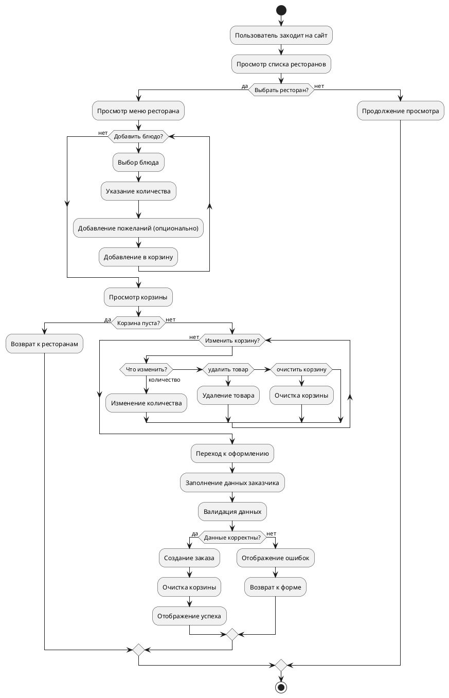

# Диаграмма активности (Activity Diagram)

## Процесс оформления заказа

### Основной поток деятельности:

1. **Начало процесса** - Пользователь заходит на сайт

2. **Выбор ресторана**
   - Условие: Пользователь хочет выбрать ресторан
   - Действие: Просмотр списка ресторанов
   - Решение: Выбрать ресторан?
   - Да: Переход к просмотру меню
   - Нет: Возврат к списку ресторанов

3. **Просмотр меню ресторана**
   - Действие: Загрузка меню выбранного ресторана
   - Отображение списка блюд с ценами

4. **Добавление блюд в корзину**
   - Условие: Пользователь хочет добавить блюдо
   - Действие: Выбор блюда
   - Действие: Указание количества
   - Действие: Добавление особых пожеланий (опционально)
   - Действие: Добавление в корзину
   - Решение: Добавить еще блюда?
   - Да: Возврат к просмотру меню
   - Нет: Переход к корзине

5. **Просмотр корзины**
   - Действие: Отображение содержимого корзины
   - Действие: Расчет общей суммы
   - Решение: Корзина пуста?
   - Да: Переход к выбору ресторана
   - Нет: Продолжение

6. **Редактирование корзины**
   - Условие: Пользователь хочет изменить корзину
   - Решение: Что изменить?
   - Изменить количество: Обновление количества товара
   - Удалить товар: Удаление товара из корзины
   - Очистить корзину: Полная очистка корзины
   - После изменений: Возврат к просмотру корзины

7. **Переход к оформлению**
   - Условие: Пользователь готов оформить заказ
   - Действие: Переход к форме оформления

8. **Заполнение данных заказчика**
   - Действие: Ввод имени и фамилии
   - Действие: Ввод email
   - Действие: Ввод телефона
   - Действие: Ввод адреса доставки
   - Действие: Выбор времени доставки (опционально)
   - Действие: Добавление дополнительных пожеланий (опционально)

9. **Валидация данных**
   - Действие: Проверка корректности введенных данных
   - Решение: Данные корректны?
   - Нет: Возврат к заполнению с сообщениями об ошибках
   - Да: Продолжение

10. **Создание заказа**
    - Действие: Расчет финальной суммы
    - Действие: Сохранение заказа в базе данных
    - Действие: Генерация номера заказа
    - Действие: Отправка подтверждения (опционально)

11. **Очистка корзины**
    - Действие: Удаление всех товаров из сессии

12. **Отображение успеха**
    - Действие: Показ страницы успешного оформления
    - Действие: Отображение номера заказа и деталей

13. **Конец процесса**

### Альтернативные потоки:

#### Поток "Отмена оформления"
- На любом этапе пользователь может нажать "Отмена"
- Действие: Возврат к корзине без сохранения изменений

#### Поток "Ошибка валидации"
- При заполнении формы обнаруживаются ошибки
- Действие: Отображение сообщений об ошибках
- Действие: Возврат к форме с сохранением введенных данных

#### Поток "Недоступное блюдо"
- При оформлении выясняется, что блюдо стало недоступным
- Действие: Уведомление пользователя
- Решение: Удалить недоступное блюдо из заказа?
- Да: Удаление и пересчет суммы
- Нет: Отмена оформления

#### Поток "Изменение количества"
- Пользователь хочет изменить количество товара
- Действие: Обновление количества в корзине
- Действие: Пересчет суммы

### Исключения:

1. **Сетевая ошибка** - при сохранении заказа
2. **Ошибка базы данных** - при создании записей
3. **Временная недоступность сервиса**

## Описание в формате PlantUML:

