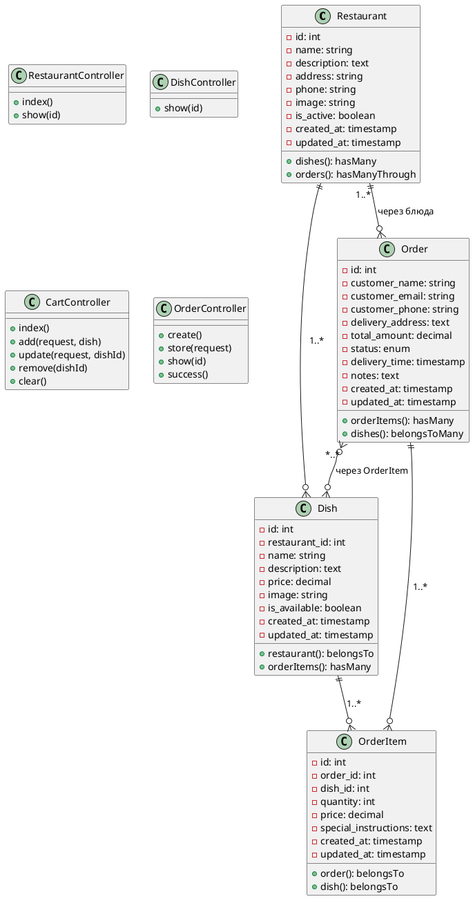

# Диаграмма классов (Class Diagram)

## Основные классы системы:

### 1. Класс Restaurant (Ресторан)
**Атрибуты:**
- id: integer (primary key)
- name: string (название ресторана)
- description: text (описание, nullable)
- address: string (адрес)
- phone: string (телефон, nullable)
- image: string (путь к изображению, nullable)
- is_active: boolean (активен ли ресторан)
- created_at: timestamp
- updated_at: timestamp

**Методы:**
- dishes(): hasMany - связь с блюдами
- orders(): hasManyThrough - связь с заказами через блюда

### 2. Класс Dish (Блюдо)
**Атрибуты:**
- id: integer (primary key)
- restaurant_id: integer (foreign key)
- name: string (название блюда)
- description: text (описание, nullable)
- price: decimal (цена)
- image: string (путь к изображению, nullable)
- is_available: boolean (доступно ли блюдо)
- created_at: timestamp
- updated_at: timestamp

**Методы:**
- restaurant(): belongsTo - связь с рестораном
- orderItems(): hasMany - связь с элементами заказов

### 3. Класс Order (Заказ)
**Атрибуты:**
- id: integer (primary key)
- customer_name: string (имя заказчика)
- customer_email: string (email заказчика)
- customer_phone: string (телефон заказчика)
- delivery_address: text (адрес доставки)
- total_amount: decimal (общая сумма)
- status: enum (статус заказа)
- delivery_time: timestamp (время доставки, nullable)
- notes: text (дополнительные пожелания, nullable)
- created_at: timestamp
- updated_at: timestamp

**Методы:**
- orderItems(): hasMany - связь с элементами заказа
- dishes(): belongsToMany - связь с блюдами через order_items

### 4. Класс OrderItem (Элемент заказа)
**Атрибуты:**
- id: integer (primary key)
- order_id: integer (foreign key)
- dish_id: integer (foreign key)
- quantity: integer (количество)
- price: decimal (цена на момент заказа)
- special_instructions: text (особые пожелания, nullable)
- created_at: timestamp
- updated_at: timestamp

**Методы:**
- order(): belongsTo - связь с заказом
- dish(): belongsTo - связь с блюдом

### 5. Класс RestaurantController
**Методы:**
- index(): отображение списка ресторанов
- show($id): отображение ресторана с меню

### 6. Класс DishController
**Методы:**
- show($id): отображение деталей блюда

### 7. Класс CartController
**Методы:**
- index(): отображение корзины
- add(Request $request, Dish $dish): добавление блюда в корзину
- update(Request $request, $dishId): обновление количества
- remove($dishId): удаление блюда из корзины
- clear(): очистка корзины

### 8. Класс OrderController
**Методы:**
- create(): форма оформления заказа
- store(Request $request): сохранение заказа
- show($id): отображение деталей заказа
- success(): страница успешного оформления

## Отношения между классами:

1. **Restaurant** --1..*--> **Dish** (Один ко многим)
2. **Restaurant** --1..*--> **Order** (Один ко многим, через блюда)
3. **Order** --1..*--> **OrderItem** (Один ко многим)
4. **Dish** --1..*--> **OrderItem** (Один ко многим)
5. **Order** --*..*--> **Dish** (Многие ко многим, через OrderItem)

## Наследование:
- Все контроллеры наследуются от базового класса Controller
- Все модели наследуются от базового класса Model

## Описание в формате PlantUML:

