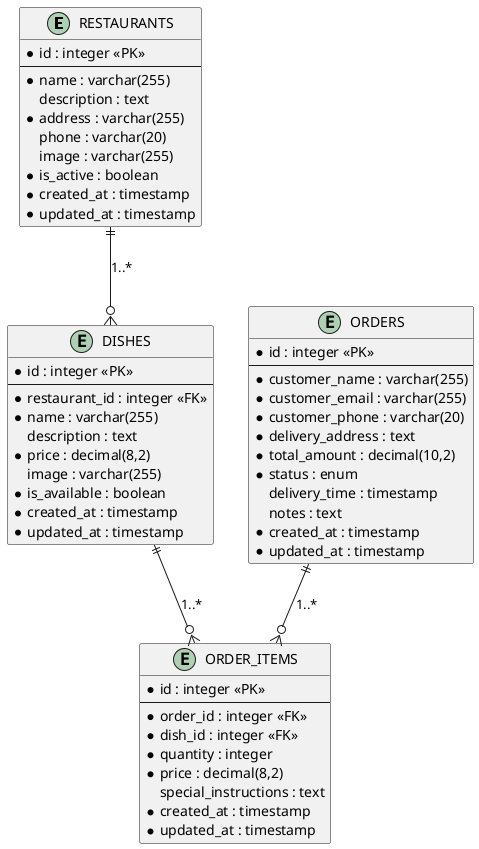

# ER-диаграмма (Entity-Relationship Diagram)

## Сущности и их атрибуты:

### 1. Сущность RESTAURANTS (Рестораны)
**Первичный ключ:** id (integer, auto_increment)

**Атрибуты:**
- id: integer (primary key)
- name: varchar(255) (название ресторана) - NOT NULL
- description: text (описание) - NULL
- address: varchar(255) (адрес) - NOT NULL
- phone: varchar(20) (телефон) - NULL
- image: varchar(255) (путь к изображению) - NULL
- is_active: boolean (активен ли ресторан) - NOT NULL, DEFAULT TRUE
- created_at: timestamp - NOT NULL
- updated_at: timestamp - NOT NULL

### 2. Сущность DISHES (Блюда)
**Первичный ключ:** id (integer, auto_increment)

**Атрибуты:**
- id: integer (primary key)
- restaurant_id: integer (foreign key -> RESTAURANTS.id) - NOT NULL
- name: varchar(255) (название блюда) - NOT NULL
- description: text (описание) - NULL
- price: decimal(8,2) (цена) - NOT NULL
- image: varchar(255) (путь к изображению) - NULL
- is_available: boolean (доступно ли блюдо) - NOT NULL, DEFAULT TRUE
- created_at: timestamp - NOT NULL
- updated_at: timestamp - NOT NULL

### 3. Сущность ORDERS (Заказы)
**Первичный ключ:** id (integer, auto_increment)

**Атрибуты:**
- id: integer (primary key)
- customer_name: varchar(255) (имя заказчика) - NOT NULL
- customer_email: varchar(255) (email заказчика) - NOT NULL
- customer_phone: varchar(20) (телефон заказчика) - NOT NULL
- delivery_address: text (адрес доставки) - NOT NULL
- total_amount: decimal(10,2) (общая сумма) - NOT NULL
- status: enum('pending', 'confirmed', 'preparing', 'ready', 'delivered', 'cancelled') - NOT NULL, DEFAULT 'pending'
- delivery_time: timestamp (время доставки) - NULL
- notes: text (дополнительные пожелания) - NULL
- created_at: timestamp - NOT NULL
- updated_at: timestamp - NOT NULL

### 4. Сущность ORDER_ITEMS (Элементы заказа)
**Первичный ключ:** id (integer, auto_increment)

**Атрибуты:**
- id: integer (primary key)
- order_id: integer (foreign key -> ORDERS.id) - NOT NULL
- dish_id: integer (foreign key -> DISHES.id) - NOT NULL
- quantity: integer (количество) - NOT NULL
- price: decimal(8,2) (цена на момент заказа) - NOT NULL
- special_instructions: text (особые пожелания) - NULL
- created_at: timestamp - NOT NULL
- updated_at: timestamp - NOT NULL

## Связи между сущностями:

### 1. Связь RESTAURANTS - DISHES
- **Тип связи:** Один ко многим (1:N)
- **Описание:** Один ресторан может иметь много блюд
- **Реализация:**
  - В таблице DISHES есть внешний ключ restaurant_id
  - Каскадное удаление: при удалении ресторана удаляются все его блюда
  - Обязательная связь (restaurant_id NOT NULL)

### 2. Связь ORDERS - ORDER_ITEMS
- **Тип связи:** Один ко многим (1:N)
- **Описание:** Один заказ может содержать много элементов
- **Реализация:**
  - В таблице ORDER_ITEMS есть внешний ключ order_id
  - Каскадное удаление: при удалении заказа удаляются все его элементы
  - Обязательная связь (order_id NOT NULL)

### 3. Связь DISHES - ORDER_ITEMS
- **Тип связи:** Один ко многим (1:N)
- **Описание:** Одно блюдо может быть в разных элементах заказов
- **Реализация:**
  - В таблице ORDER_ITEMS есть внешний ключ dish_id
  - Каскадное удаление: при удалении блюда удаляются все связанные элементы заказов
  - Обязательная связь (dish_id NOT NULL)

### 4. Косвенная связь RESTAURANTS - ORDERS
- **Тип связи:** Многие ко многим (N:M) через DISHES и ORDER_ITEMS
- **Описание:** Ресторан может быть связан с заказами через блюда
- **Реализация:** Через промежуточные таблицы DISHES и ORDER_ITEMS

## Бизнес-правила:

1. **Активность ресторана:** Только активные рестораны (is_active = TRUE) отображаются пользователям
2. **Доступность блюд:** Только доступные блюда (is_available = TRUE) можно добавлять в корзину
3. **Статусы заказов:**
   - pending: ожидает подтверждения
   - confirmed: подтвержден
   - preparing: готовится
   - ready: готов к доставке
   - delivered: доставлен
   - cancelled: отменен
4. **Цена на момент заказа:** В ORDER_ITEMS сохраняется цена на момент оформления заказа
5. **Общая сумма заказа:** Рассчитывается как сумма (quantity * price) всех элементов заказа

## Описание в формате PlantUML:

