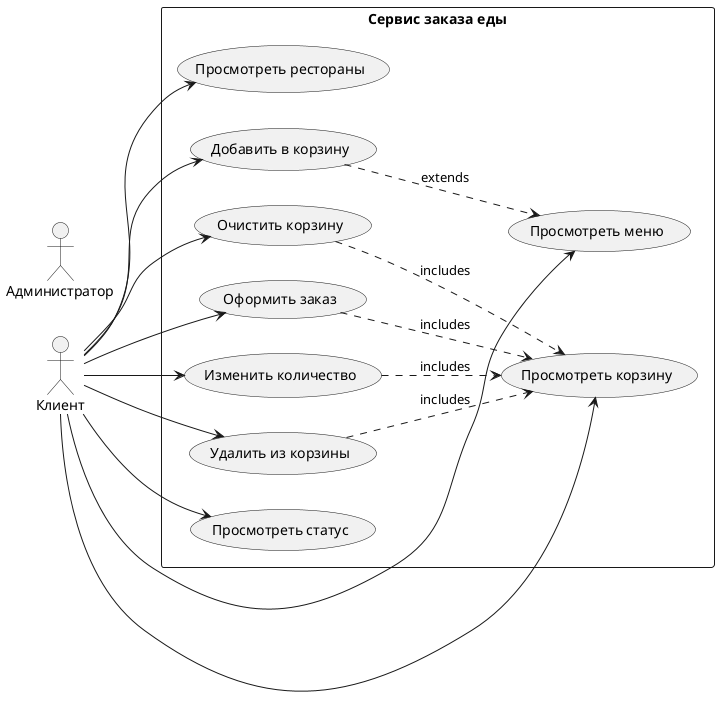

# Диаграмма вариантов использования (Use Case Diagram)

## Акторы системы:

1. **Клиент** - пользователь сервиса заказа еды
2. **Администратор** - управляющий системой (опционально для будущих расширений)

## Варианты использования:

### Для актора "Клиент":

1. **Просмотреть список ресторанов**
   - Предусловия: Пользователь зашел на главную страницу
   - Основной поток:
     - Система отображает список активных ресторанов
     - Пользователь может фильтровать рестораны по различным критериям
   - Постусловия: Отображен список ресторанов

2. **Просмотреть меню ресторана**
   - Предусловия: Пользователь выбрал ресторан из списка
   - Основной поток:
     - Система загружает информацию о ресторане
     - Отображается меню с блюдами
     - Пользователь может просматривать детали блюд
   - Постусловия: Отображено меню ресторана

3. **Добавить блюдо в корзину**
   - Предусловия: Пользователь просматривает меню ресторана
   - Основной поток:
     - Пользователь выбирает блюдо
     - Указывает количество
     - Добавляет особые пожелания (опционально)
     - Система добавляет блюдо в корзину
   - Постусловия: Блюдо добавлено в корзину

4. **Просмотреть корзину**
   - Предусловия: В корзине есть товары
   - Основной поток:
     - Система отображает содержимое корзины
     - Показывает итоговую сумму
     - Позволяет изменять количество товаров
     - Позволяет удалять товары из корзины
   - Постусловия: Отображено содержимое корзины

5. **Изменить количество товара в корзине**
   - Предусловия: Пользователь просматривает корзину
   - Основной поток:
     - Пользователь изменяет количество товара
     - Система пересчитывает стоимость
   - Постусловия: Количество изменено, стоимость пересчитана

6. **Удалить товар из корзины**
   - Предусловия: Пользователь просматривает корзину
   - Основной поток:
     - Пользователь выбирает товар для удаления
     - Подтверждает удаление
     - Система удаляет товар из корзины
   - Постусловия: Товар удален из корзины

7. **Очистить корзину**
   - Предусловия: В корзине есть товары
   - Основной поток:
     - Пользователь выбирает опцию "Очистить корзину"
     - Подтверждает действие
     - Система очищает корзину
   - Постусловия: Корзина пуста

8. **Оформить заказ**
   - Предусловия: В корзине есть товары
   - Основной поток:
     - Пользователь переходит к оформлению заказа
     - Заполняет персональные данные
     - Указывает адрес доставки
     - Выбирает время доставки (опционально)
     - Добавляет дополнительные пожелания
     - Подтверждает заказ
     - Система сохраняет заказ в базе данных
     - Генерирует номер заказа
   - Постусловия: Заказ создан, корзина очищена

9. **Просмотреть статус заказа**
   - Предусловия: Заказ оформлен
   - Основной поток:
     - Пользователь вводит номер заказа
     - Система отображает детали заказа и текущий статус
   - Постусловия: Отображен статус заказа

## Отношения между вариантами использования:

- "Просмотреть меню ресторана" включает "Просмотреть детали блюда"
- "Добавить блюдо в корзину" расширяет "Просмотреть меню ресторана"
- "Оформить заказ" включает "Просмотреть корзину"
- "Изменить количество товара" и "Удалить товар из корзины" являются частью "Просмотреть корзину"

## Описание в формате PlantUML:

